

# MANUAL DE USUARIO

## ANÁLISIS Y DESARROLLO DE SOFTWARE

---

## ACCIONES DE SEGTRACK

 
 

**TUTOR**

Elsa María Junca Bernal

 
 

**APRENDICES**

Andres Camilo Carrillo Jaimes

Michael David Montoya Pasachoa

Anderson Estiven Moreno Pinzon

 
 

**2025**

---

# Proyecto SEGTRACK

## Tabla de Contenido

- [1. Introducción](#1-introducción)
- [2. Descripción del Proyecto](#2-descripción-del-proyecto)
- [3. Quiénes Usan Segtrack](#3-quiénes-usan-segtrack)
  - [3.1 Personal de Seguridad](#31-personal-de-seguridad--los-ojos-en-la-puerta)
  - [3.2 Supervisor](#32-supervisor--el-control-del-día-a-día)
  - [3.3 Administrador](#33-administrador--el-cerebro-del-sistema)
- [4. ¿Qué Controla Segtrack?](#4-qué-controla-exactamente-segtrack)
  - [4.1 Entrada y Salida de Funcionarios](#41-entrada-y-salida-de-funcionarios-)
  - [4.2 Control de Dispositivos](#42-control-de-dispositivos-)
  - [4.3 Control de Parqueadero](#43-control-de-parqueadero-)
- [5. Tecnologías Utilizadas](#5-tecnologías-utilizadas)
- [6. Uso del Sistema](#6-uso-del-sistema)
- [7. Pantalla Principal](#7-pantalla-principal)
- [8. Inicio de Sesión](#8-inicio-de-sesión)
  - [8.1 Validaciones del Formulario](#81-validaciones-del-formulario)
- [9. Recuperación de Contraseña](#9-recuperación-de-contraseña)
- [10. Registrar Funcionarios](#10-registrar-funcionarios)
  - [10.1 Validaciones del Formulario de Registro](#101-validaciones-del-formulario-de-registro)
- [11. Lista de Funcionarios](#11-lista-de-funcionarios)
  - [11.1 Acciones Disponibles](#111-acciones-disponibles)
- [12. Módulo Instituto](#12-módulo-instituto)
- [13. Módulo Sede](#13-módulo-sede)
- [14. Módulo Parqueadero — Administrador](#14-módulo-parqueadero--administrador)
- [15. Módulo Parqueadero — Personal de Seguridad](#15-módulo-parqueadero--personal-de-seguridad)
- [16. Registro de Vehículos](#16-registro-de-vehículos)
- [17. Autores](#17-autores)

---

## 1. Introducción

El presente Manual de Usuario ha sido elaborado con el propósito de brindar una guía clara, práctica y comprensible para el uso adecuado del aplicativo Segtrack. Este documento busca orientar a los usuarios en la interacción con las diferentes funcionalidades del sistema, facilitando la comprensión de sus herramientas y el correcto desarrollo de las actividades que se realizan dentro de la plataforma.

La creación de este manual responde a la necesidad de contar con un material de apoyo que permita a los usuarios conocer el funcionamiento del aplicativo de manera organizada y estructurada. A través de este documento se describen los procesos, opciones y características principales del sistema, proporcionando instrucciones claras que permiten realizar cada tarea de forma eficiente y segura.

---

## 2. Descripción del Proyecto

**¿Qué es Segtrack?**

Segtrack es un sistema de control de acceso inteligente para instituciones o empresas que necesitan llevar un registro preciso y seguro de quién entra, quién sale, con qué dispositivo y en qué parqueadero se encuentra cada funcionario. Todo esto funciona a través de **códigos QR**, eliminando el papeleo, los registros manuales y los errores humanos.

> 💡 Imagínalo como el portero digital de una organización — uno que nunca duerme, nunca olvida y siempre tiene todo registrado.

---

## 3. Quiénes Usan Segtrack

### 3.1 Personal de Seguridad — Los Ojos en la Puerta

🔵 Son quienes están en el punto de acceso físico. Su trabajo en Segtrack es simple pero crucial: escanean el QR del funcionario que llega o sale, y registran si trae un dispositivo (computador, tablet, etc.) o si ingresa en vehículo al parqueadero. Su responsabilidad es registrar con precisión todo lo que ocurre en tiempo real.

### 3.2 Supervisor — El Control del Día a Día

🟡 El supervisor tiene visibilidad completa de lo que ocurre en su sede: quién entró, a qué hora, qué dispositivos ingresaron y cuántos puestos del parqueadero están ocupados. Ante cualquier situación inusual, es el encargado de actuar. Además, puede generar reportes por turno y gestionar las novedades que se presenten.

### 3.3 Administrador — El Cerebro del Sistema

🔴 El administrador cuenta con acceso total al sistema. Registra a los funcionarios, les asigna sus códigos QR, gestiona las sedes, activa o desactiva cuentas y consulta el historial completo de movimientos. Si el supervisor es quien observa el partido, el administrador es quien construye el estadio y establece las reglas del juego.

---

## 4. ¿Qué Controla Exactamente Segtrack?

### 4.1 Entrada y Salida de Funcionarios 🚶

Cada funcionario tiene un **QR único y personal**. Al llegar o retirarse, el personal de seguridad lo escanea y el sistema registra automáticamente la hora, la sede y el estado del movimiento. Sin firmas, sin planillas, sin confusiones.

### 4.2 Control de Dispositivos 💻

Si un funcionario ingresa con un portátil, una tablet o cualquier equipo tecnológico, esa información también queda registrada. El sistema sabe qué dispositivo entró, con quién y en qué momento salió, lo que permite prevenir pérdidas o salidas no autorizadas de equipos institucionales.

### 4.3 Control de Parqueadero 🚗

Segtrack gestiona los espacios de estacionamiento disponibles por sede. El sistema conoce la disponibilidad en tiempo real, qué funcionarios tienen vehículo registrado y mantiene un historial detallado de entradas y salidas de vehículos.

---

## 5. Tecnologías Utilizadas

| Tecnología | Uso |
|------------|-----|
|  | Lógica del servidor y controladores |
|  | Interacción dinámica en el navegador |
|  | Base de datos relacional |
|  | Diseño responsivo de la interfaz |
|  | Manipulación del DOM y peticiones AJAX |

---

## 6. Uso del Sistema

El sistema permite iniciar sesión de acuerdo con el rol asignado a cada usuario. Al ingresar las credenciales (correo electrónico junto con la contraseña), Segtrack valida la información y redirige automáticamente al panel de control correspondiente:

| Rol | Panel de acceso |
|-----|----------------|
| 🔵 Personal de Seguridad | Dashboard de escaneo y registro |
| 🟡 Supervisor | Dashboard de monitoreo y reportes |
| 🔴 Administrador | Dashboard de gestión total |

---

## 7. Pantalla Principal

Segtrack ofrece una interfaz de bienvenida atractiva y moderna, diseñada para presentar de forma clara la propuesta principal del sistema: el control de entrada y salida de funcionarios mediante códigos QR. Desde esta pantalla el usuario puede navegar hacia el inicio de sesión y conocer más sobre la plataforma.

---

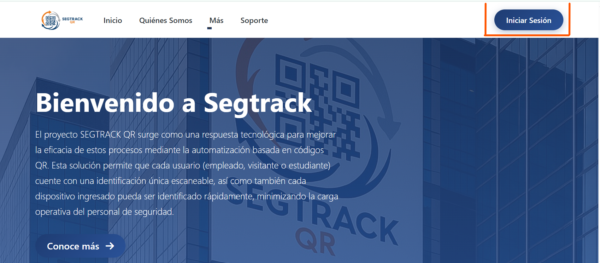

---

## 8. Inicio de Sesión

Para ingresar al sistema, el usuario debe dirigirse a la parte superior de la página y hacer clic en el botón **"Iniciar Sesión"**.

---

Al hacer clic, el sistema redirige al formulario de autenticación donde se deben ingresar las credenciales registradas.

---

Este formulario valida la identidad de todos los funcionarios que cuenten con un rol activo en la institución. Una vez autenticado correctamente, el usuario podrá interactuar con los módulos habilitados según su perfil.

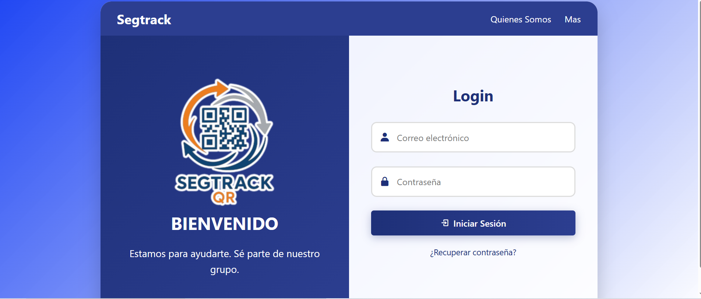

---

### 8.1 Validaciones del Formulario

El sistema cuenta con un conjunto de validaciones que garantizan la integridad del acceso. Ante cualquier error, se muestran notificaciones visuales y cambios de color en los campos correspondientes para guiar al usuario de forma inmediata.

---

- **Campos incompletos** — cuando se intenta ingresar sin llenar todos los campos requeridos:

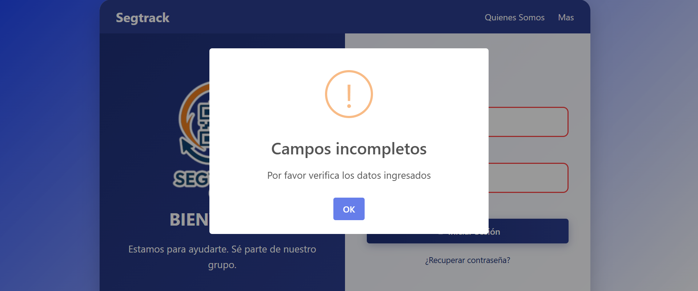

---

- **Correo no registrado** — cuando el correo ingresado no existe en la base de datos:

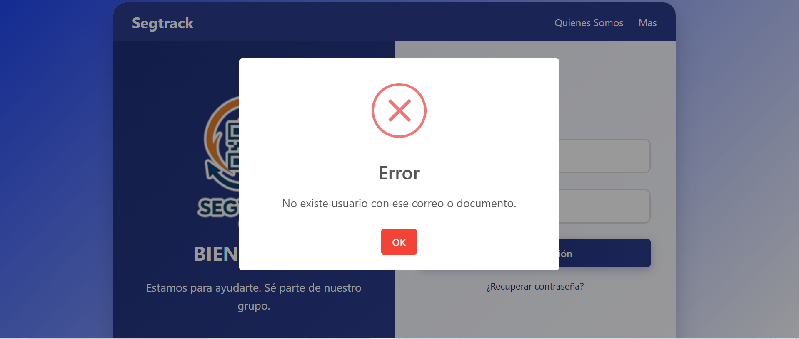

---

- **Contraseña incorrecta** — cuando las credenciales no coinciden con las registradas:

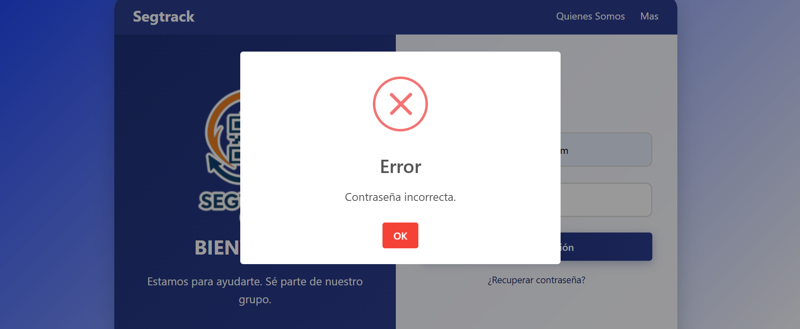

---

- **Credenciales correctas** — acceso exitoso al sistema:

---

## 9. Recuperación de Contraseña

En caso de olvidar la contraseña, Segtrack ofrece un proceso de recuperación sencillo y seguro. Esta funcionalidad está disponible exclusivamente para funcionarios con un rol activo en el sistema.

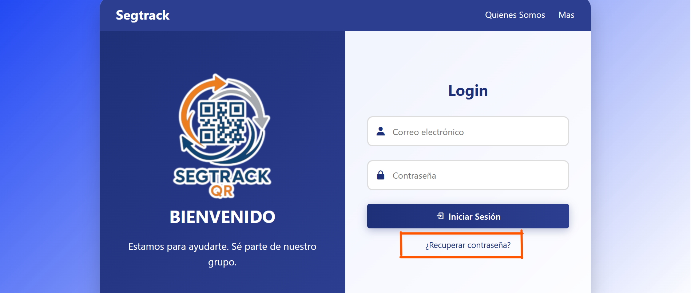

---

Al seleccionar la opción de recuperación, el sistema solicita el correo electrónico registrado y verifica si existe en la base de datos antes de continuar con el proceso.

---

- **Correo no registrado** — si el correo ingresado no se encuentra en el sistema:

---

- **Correo registrado** — si el correo es válido, el sistema envía un token de verificación al correo electrónico del usuario:

**Notificación de envío:**

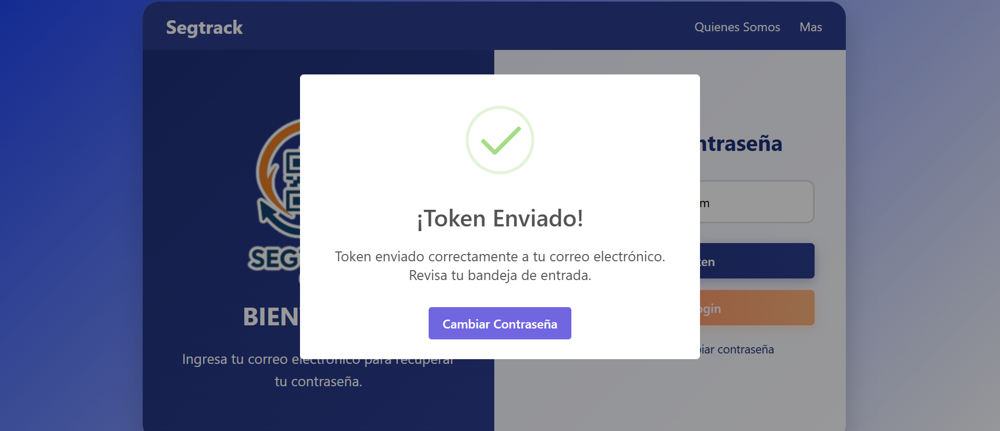

**Token recibido en el correo:**

---

El sistema solicita el token recibido para poder realizar el cambio de contraseña. Este token tiene una vigencia de **15 minutos**.

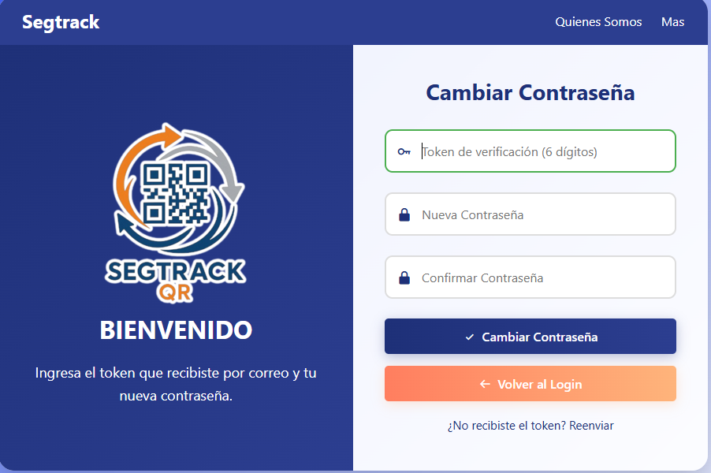

---

Después de ingresar el token y establecer la nueva contraseña, el usuario puede acceder normalmente al panel principal del aplicativo.

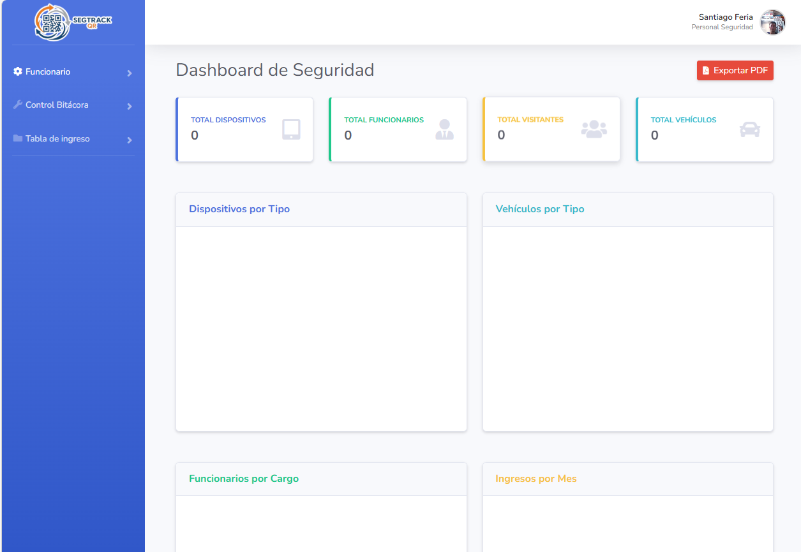

---

## 10. Registrar Funcionarios

En esta sección se trabaja con el perfil de **Personal de Seguridad**, el cual puede registrar a un funcionario en el sistema con sus datos principales y una foto. Al completar el registro, el sistema genera automáticamente un código QR único y lo envía al correo registrado del funcionario.

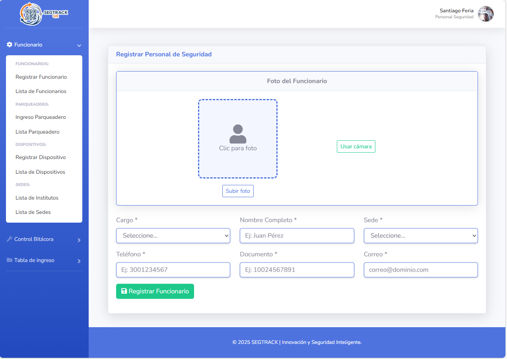

---

El formulario está configurado con validaciones en todos sus campos para garantizar que la información ingresada sea correcta y evitar caracteres inapropiados o datos incompletos.

### 10.1 Validaciones del Formulario de Registro

- **Datos duplicados** — cuando el documento o correo ya existe en el sistema:

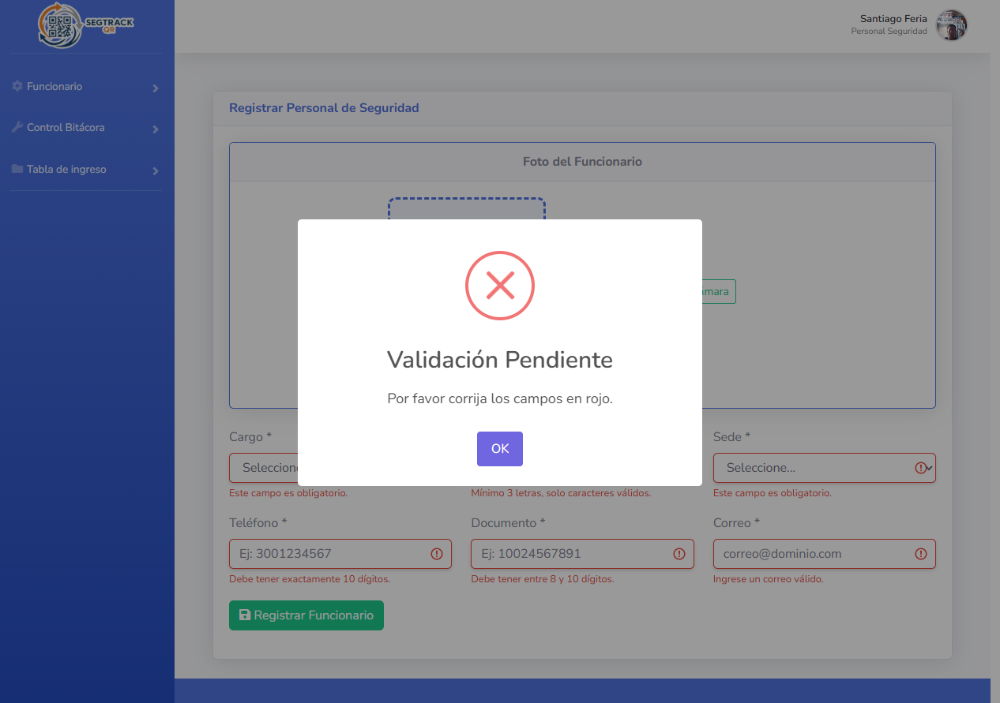

---

- **Formulario correctamente diligenciado:**

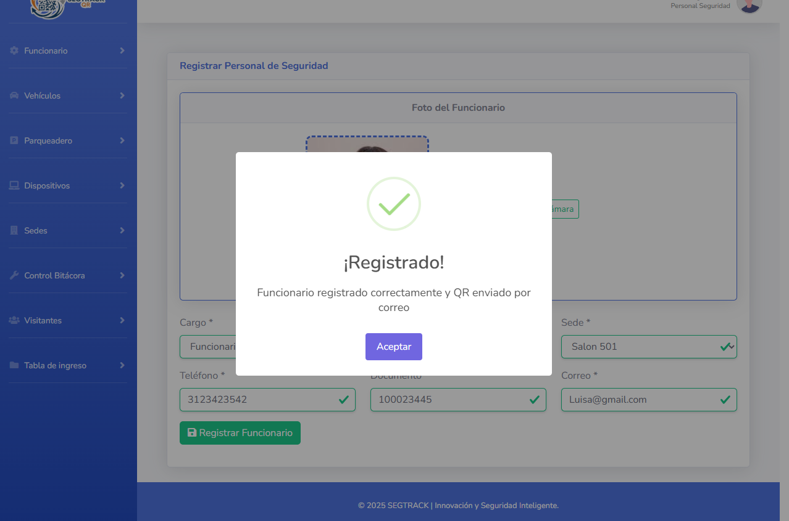

---

- **Notificación de registro exitoso:**

---

## 11. Lista de Funcionarios

En este módulo se visualiza un listado completo del personal registrado por el guarda de seguridad. La tabla permite filtrar por cantidad de registros y por datos específicos, facilitando la búsqueda de cualquier funcionario. Además, es posible editar la información de cada funcionario y cambiar su estado entre Activo e Inactivo según corresponda.

---

### 11.1 Acciones Disponibles

**1. Visualización del QR**

---

**2. Envío del QR por correo**

---

**3. Actualización de datos del funcionario**

---

**4. Cambio de estado del funcionario**

---

## 12. Módulo Instituto

El módulo de Instituto permite al personal de seguridad visualizar las instituciones vinculadas al sistema y verificar su estado — activo o inactivo.

---

## 13. Módulo Sede

El módulo de Sede permite al personal de seguridad tener un listado de las sedes para verificar cuáles están activas o inactivas.

---

## 14. Módulo Parqueadero — Administrador

El Administrador puede configurar los espacios del parqueadero por sede. Para hacerlo, debe ingresar al módulo de Parqueadero, seleccionar la opción **"Configurar sede"** y especificar la cantidad de espacios disponibles para cada tipo de vehículo. Una vez creado, el parqueadero queda visible en la lista principal donde puede ser editado, activado o inactivado según se requiera.

---

## 15. Módulo Parqueadero — Personal de Seguridad

Cuando el guarda de seguridad ingresa al módulo de Parqueadero, puede seleccionar la sede en la que se encuentra y elegir el espacio disponible donde el vehículo se ubicará según su tipo. El sistema muestra en tiempo real los espacios libres y ocupados, facilitando el control del flujo vehicular.

---

## 16. Registro de Vehículos

En este módulo el Personal de Seguridad puede registrar los vehículos que ingresan a cualquiera de las sedes en las que esté trabajando. El sistema solicita los datos del vehículo (placa, tipo, número de tarjeta de propiedad) y los asocia al funcionario o visitante correspondiente. El sistema valida que la placa no esté duplicada y registra automáticamente la fecha y hora del movimiento.

---

## 17. Autores

Proyecto desarrollado por aprendices del programa de **Análisis y Desarrollo de Software**:

| Nombre | GitHub |
|--------|--------|
| Andres Camilo Carrillo Jaimes | [@usuario](https://github.com) |
| Michael David Montoya Pasachoa | [@usuario](https://github.com) |
| Anderson Estiven Moreno Pinzon | [@usuario](https://github.com) |

> **Tutora:** Elsa María Junca Bernal